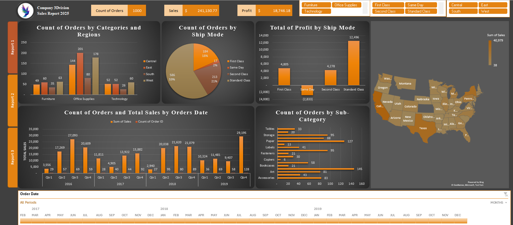
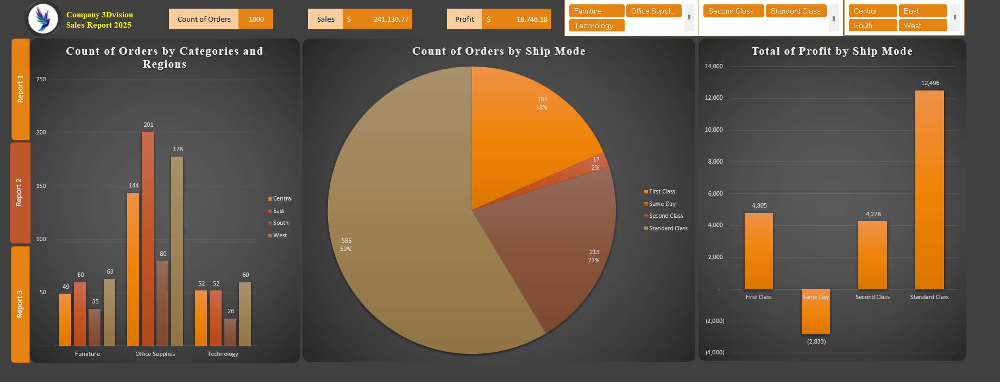

# Excel Sales Dashboard

An interactive Excel sales dashboard that summarizes order performance, sales, and profit across categories, regions, shipping modes, sub-categories, and time periods.

## Dashboard Preview

### Full Dashboard

### Shipping and Category Analysis

## Key Highlights

- **1,000** total orders
- **$241,130.77** in total sales
- **$18,746.18** in total profit
- Interactive filters for category, ship mode, region, and order date
- Analysis by category, sub-category, region, quarter, and shipping mode
- Geographic sales view across U.S. states

## Dashboard Components

- KPI cards for order count, sales, and profit
- Orders by category and region
- Orders and profit by shipping mode
- Quarterly sales and order trends
- Sub-category performance comparison
- U.S. map visualization
- Slicers and timeline for interactive exploration

## Tools Used

- Microsoft Excel
- PivotTables and PivotCharts
- Slicers and Timeline
- Excel Map Charts
- Dashboard design and data visualization

## Project Files

- `dashboard.xlsx` — interactive Excel dashboard
- `images/` — dashboard screenshots used in this README

## How to Use

1. Download `dashboard.xlsx`.
2. Open it in Microsoft Excel.
3. Use the slicers and timeline to filter the dashboard.
4. Select the report tabs to explore the different dashboard views.

